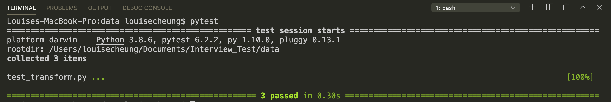
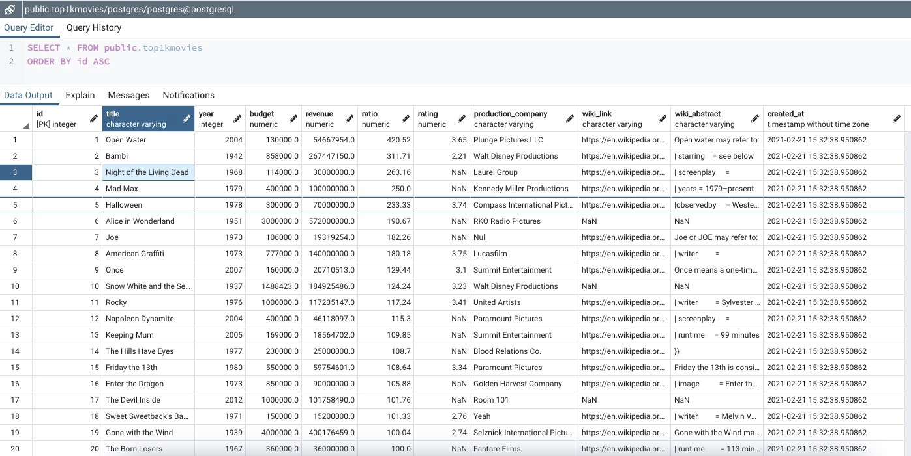

# ETL solution 
### Author: LC 

## Introduction</br>

This ETL solution is built by docker image and hosted on kubernetes platform.

## Method to execute the solution

It can be run by deploying the docker image on kubernetes. No any local libraries setups are needed in order to ease the conflicts from local environment. 

In kubernetes cluster, we can run the command: 
```kubectl apply -f cronjon.yml```

## Tool Selection

Language:

- python

Tools (Library):

- pandas
- sqlalchemy

Procedures:

1. Use an init container to download the movie files from kaggle and wiki data.

2. Use pandas to extract raw 'csv' files and 'xml' file and do the data transformation (see: extract.py and transform.py)

3. Use sqlalchemy to create and insert data into table (see: load.py)

## Reasons for choosing Python and Pandas

**1. Many libraries support in python community**

- Python is the most common language in handling data processing tasks. It provides a lot of libraries in handling data.

**2. Easy to deploy and maintain**

- It can directly be deployed via docker image on kubernetes with cronjob setting. A developer can easily change the code and deploy it to docker container repository like ECR in AWS. Then, the task can be automatically updated as the kubernetes will trigger and deploy a new image for a cronjob task.

**3. Cost saving**

- This solution does not require extra tools or services to generate the result. The processing speed can be improved by using pyspark instead of pandas but it requires extra cost when using Spark, like EMR in AWS.

## Reason for choosing sqlalchemy

1. Using ORM is an efficient way to insert data.

## Algorithmic choices (data cleaning assumptions)

1. Some raw data in movie_metadata were filtered out by language, budget, revenue and status of movies. 

    **Filter criteria:** 

    1. The movie language is in English. It is because we need to map the english wiki data.
    2. The status is "released". There is no point to choose non-released movies as they do not have revenue.
    3. The budget must be more than 1M. It is because the average production cost is 15M nowadays.  
    4. The revenue must be more than 0. 
2. There is no filtering on wiki data. 

## Testing Result

In this challenge, I used "pytest" to verify the data output quality. 

### PyTest with 3 test conditions

1. The expected data shape (1000 rows * 9 columns)
2. All the columns are exported as required. 
3. There is no duplication row based on name and production year.


### The pytest result:



### The result in postgres database:



### The kubernetes result:


## Remarks:
1. In the inti container, the kaggle API key has been replaced as dummy value.
2. The docker image runs in local kubernetes, so there is no secret applied in the yml file. The credentials should be stored  in KMS or vault in production environment.